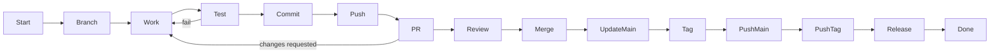

## Fluxograma: Branch → Merge → Tag → Release

```mermaid
flowchart LR
  Start --> Branch
  Branch --> Work
  Work --> Test
  Test --> Commit
  Commit --> Push
  Push --> PR
  PR --> Review
  Review --> Merge
  Merge --> UpdateMain
  UpdateMain --> Tag
  Tag --> PushMain
  PushMain --> PushTag
  PushTag --> Release
  Release --> Done

  Test -->|fail| Work
  PR -->|changes requested| Work
```

O diagrama acima mostra o fluxo típico desde a criação de uma branch de feature até a publicação de uma tag e release no GitHub.
